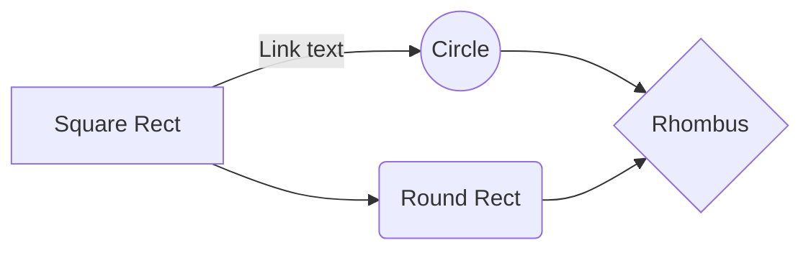

You can completely uninstall system apps without root. In doing so, it uses a script from Android Studio. The deleted application can be reinstalled later.

!! Currently it only works on Windows platform.

## Download App Remover [NoRoot]
- [Windows Download]()
- [Linux Download (Soon)]()

## How to use ?

## Screenshots

